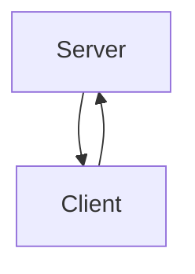
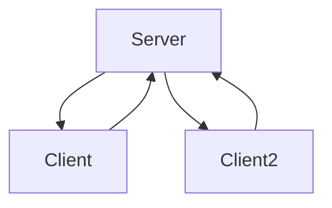

# Networking Basics Notes

## echo-tcp

### Simple Diagram

### Starting Thoughts
- I have worked with plenty of API/web app concepts in C#, but not a low level (sockets), connection-based server where I am the one writing the logic for connections.
- I will create a simple "echo" tcp server in 4 languages: Python, C#, JS, and GO
- I do have quite a bit of experience in Python, C#, and JS. I am confident these three will be very easy to implement in a small amount of time.
- Starting out with the easiest possible implementation. There will not be a lot of error checking, try/catch, etc. 

### Python Thoughts
- Interesting how many of the socket functions use tuples
- Overall the process is incredibly simple with the usage of the 'socket' library
- It looks like the 'socket' library has low-level and high-level implementations that could be utilized (e.g. 'send' vs 'sendall'). I am going to use the high-level ones for now, but might come back and implement the server again with lower level concepts after I finish the other three languages

### C# Thoughts
- C# socket library was much easier to read EXCEPT for Bind(). It was a little difficult to understand the concept of IPEndpoint without looking it up.
- Encoding was a bit trickier

### GO Thoughts
- While the newest language for me, it felt the most simple and straightforward
- Not sure what the normal conventions are for error checking and helper functions
- Need to look into Goroutines (threading)

### Final Thoughts
- Python was probably the easiest to create, but GO felt more powerful with the low-level functionality
- I think I will continue making projects in GO for the time being. I may come back at some point and do all projects in all 3 languages.

## Simple UDP Chat Service

### Starting Thoughts
- How can I use goroutines for this?
- How do I send messages across goroutines?
- Serialization (marshalling) of data is not something I have really done before other than using DTOs for APIs. This goes a level deeper to actually put that data into bytes

### Final Thoughts
- It was both easier and harder to understand marshalling. Once I was able to wrap my head around HOW to do marshalling and unmarshalling, implementing it in the server and client files was relatively easy.
- I think using protocols will probably be an easier route, but I have not compared them yet